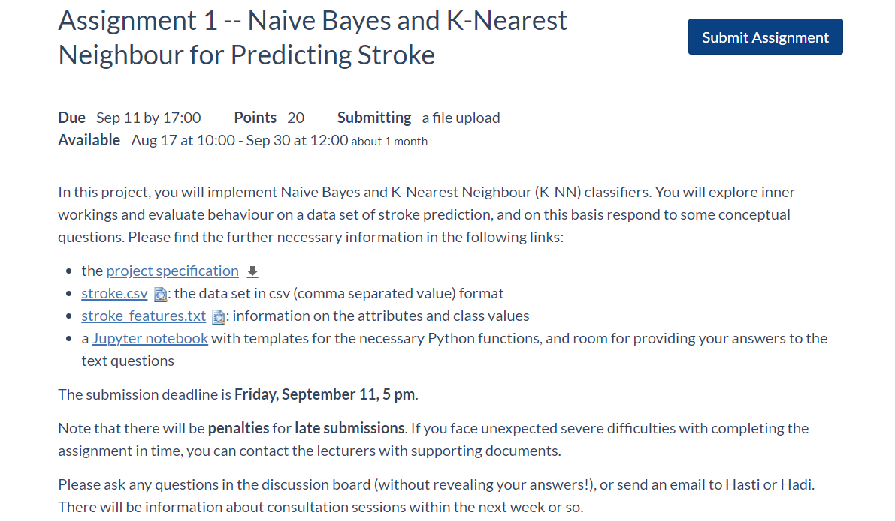

# Naive-Bayes-and-KNN-classifiers
COMP90049 - Intro to Machine Learning - 2020S2 - Assignment1
## Assignment 1
- 

## result
- ```
    COMP90049: Introduction to Machine Learning
    Assignment 1: Naive Bayes and K-Nearest Neighbour for Predicting Stroke

    Dear Xulin,

    Your Final mark for Assignment 1 is 17.25 out of 20.

    **For the coding part, your mark is 4 out of 5. 

    Here is the markers feedback: 
        The preprocess() function was expected to open the data file.You need set the random_state value to a certain integer for code to be testable..

    **For Answers to Question, your mark is 13.25 out of 15.

    Question1
    Part A
        Mark: 3 out of 3.
        Comments: None
    Part B
        Mark:1.5 out of 2.
        Comments:Since we are looking for the diagnosis of stroke, recall about the desired label (1) and probably f-score (because it includes recall) is more appropriate. For developing the answer, you need to use an argument make connection with the data and connect it to the theories of the evaluation metrics.

    Question2
    Part A
        Mark: 1 out of 1.
        Comments: None
    Part B
        Mark: 3.25 out of 4.
        Comments: Your answer is not clear. It's not a good idea to put your all test and trying work in the document. It is very long and it is not clear which is the main answer.  You need to compare the selected metrics regarding the desired class (stroke) not the whole systems. The precision, recall and F1 for the baseline cannot be calculated as in the baseline the True Positive is zero. So, the NB model works better than baseline.
    Part C
        Mark: 1 out of 1.
        Comments: None

    Question3
    Part A
        Mark: 1 out of 1.
        Comments: None
    Part B
        Mark: 1.75 out of 2.
        Comments: Didn't mention TP = 0 in 0-R.
    Part C
        Mark: 0.75 out of 1.
        Comments:  Not enough discussion about the metrics.

    Also, you lost some marks for the following issues:
        Too long answers

    Kind regards,
    COMP90049 Teaching team 

    ```

- 